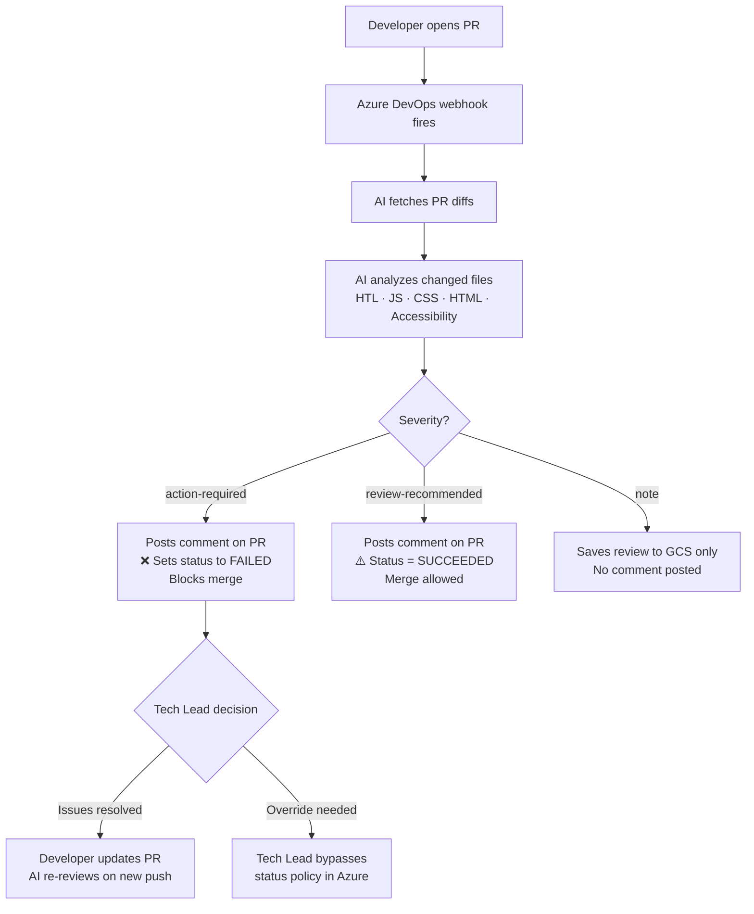

# AI-Assisted PR Review Process

> **Audience:** Tech Leads
> **System:** RAWL 9001 — Automated AEM PR regression reviewer

---

## Overview

Every pull request targeting the main branch is automatically analyzed by an AI reviewer before it can be merged. The AI focuses on **AEM frontend regression risks** — not code style. If it finds blocking issues, the PR status check will fail and prevent merge until resolved or overridden.

---

## How It Works



---

## Review Categories

| Category | Azure Status | Blocks Merge? | When It's Used |
|---|---|---|---|
| **action-required** | ❌ Failed | **Yes** | Security issues, breaking changes, data loss risk, production-impacting bugs |
| **review-recommended** | ✅ Succeeded | No | Performance concerns, edge cases, changes needing extra verification |
| **note** | *(no status posted)* | No | Minor observations, future suggestions, awareness items |

---

## What Triggers a Block (`action-required`)

The AI flags issues that could break production. Common reasons:

- **Breaking interface changes** — renamed/removed functions, CSS classes, or data attributes that other components depend on
- **AEM dialog/Sling Model contract changes** — altered HTL template parameters or removed Sling Model properties
- **Security vulnerabilities** — XSS, unsafe DOM manipulation, exposed credentials
- **JavaScript behavioral regressions** — changed function signatures in shared utilities, altered event handling
- **Accessibility regressions** — WCAG 2.2 violations introduced by HTML structure changes

> The AI **only reviews lines that changed in the diff.** It will not flag pre-existing issues in unchanged code.

---

## The Azure Status Policy

The `rawl-reviews/ai-review` status check is configured as **Required** on the target branch. This means:

- A `succeeded` status is needed to complete the pull request
- Only the authorized service account can post this status (preventing spoofing)


> **Note:** The screenshot above shows the policy configuration. The status name in Azure is `rawl-reviews/ai-review`.

---

## How to Override a Block

If the AI has flagged a false positive or you've verified the issue is not a concern, you can override as a tech lead:

1. Open the PR in Azure DevOps
2. Click **"Complete"** on the PR
3. In the completion dialog, check **"Override branch policies and enable merge"**
4. Add a comment explaining the override reason
5. Complete the merge

> Overrides are logged in the PR history. Use them intentionally.

---

## Re-triggering the Review

The AI re-runs automatically on every new push to the PR branch. If a developer pushes a fix:

1. The new commit triggers a fresh review
2. A new comment is posted with the updated findings
3. The status check updates accordingly

There is no manual trigger needed — just push a new commit.

---

## Where to Find the AI Review Comment

In the PR, look for a comment from the service account containing:

```
## Impact Assessment Summary
| Code Snippet | Issue | Recommended Solution | Priority |
```

Each finding includes the file path, a description of the risk, and a recommended action.

---

## Scope — What the AI Does NOT Review

- Code style or formatting preferences
- Unchanged lines (context lines are used for understanding only)
- Business logic correctness
- Unit test coverage (unless a test deletion causes a regression risk)
